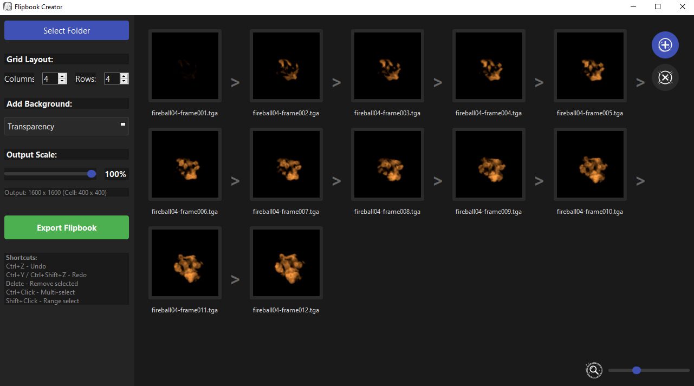

# Flipbook Creator 🎬

> A simple desktop tool (Python/PySide6) to quickly pack image sequences into a single sprite sheet (or flipbook texture).
> Designed for technical artists and VFX artists who need a fast way to package animation frames for game engines like Unity or Unreal Engine.

---

## ✨ Key Features

* **Flexible Loading:** Load all images from a folder (with automatic sorting) or add individual files.
* **Drag-and-Drop:** Easily reorder frames just by dragging and dropping.
* **Advanced Selection:**
    * `Click`: Select a single frame.
    * `Ctrl+Click`: Multi-select frames.
    * `Shift+Click`: Select a range of frames.
    * `Delete`: Remove selected frames.
* **Undo/Redo History:** Full Undo/Redo support (`Ctrl+Z` / `Ctrl+Y`) for sorting and deletions.
* **Grid Control:** Set the exact number of columns and rows for your atlas.
* **Background Control:** Export with a transparent background or any custom solid color.
* **Output Scaling:** Scale the final texture down (e.g., to 50% or 25%) for optimization.
* **Info-Rich UI:** Instantly see the final texture resolution and the size of a single cell.
* **Flexible Export:** Save your flipbook in `PNG`, `TGA`, `JPG`, `WEBP`, and other formats.

---

## 🚀 Running the App (Windows)

This method requires **Python 3.7+** to be installed on your system.
*(Make sure to check "Add Python to PATH" during the Python installation)*.

1.  Download or clone the repository.
2.  Double-click **`Run.bat`** to start the program.

> **What happens on the first launch?**
> A console window will appear and automatically:
> 1.  Create a local virtual environment (in a `.venv` folder).
> 2.  Install all required libraries (`PySide6`, `Pillow`) from `requirements.txt`.
>
> This process may take a minute. All future launches will be instant.

---

## 🛠️ Technology Used

* **Python 3**
* **PySide6 (Qt for Python):** For the entire graphical user interface.
* **Pillow (PIL):** For robust image loading and saving (especially for formats like TGA).
